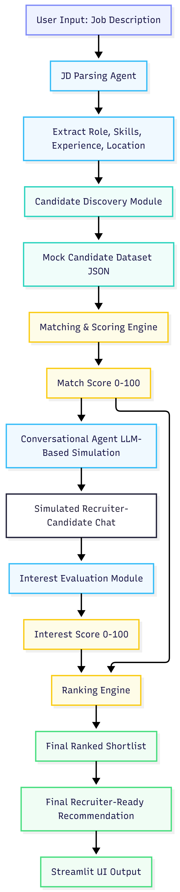

# AI Talent Scouting & Engagement Agent

🔗 **Live App:** https://ai-talent-agent-gpsdsjycvyph3vsbuwb5a7.streamlit.app/

An end-to-end AI agent that automates candidate discovery, engagement, and ranking based on job descriptions.

---

## Features

* JD Parsing (extracts role, skills, experience, location)
* Candidate Discovery (mock database)
* Skill Matching with explainability
* Conversational Outreach (simulated recruiter-candidate chat)
* Interest Evaluation using LLM
* Final Ranking with combined score
* Recruiter-ready recommendation

---

## Agent Workflow

1. JD Parsing
2. Candidate Discovery
3. Matching
4. Conversational Outreach (Simulated)
5. Interest Evaluation
6. Ranking

---

## Tech Stack

* Python
* Streamlit
* OpenRouter (LLM API)
* JSON (mock database)

---

## Architecture Diagram



---

## Scoring & Decision Logic

The system evaluates candidates using a combination of rule-based matching and AI-driven analysis.

### Match Score (0–100)

The match score is calculated based on:

* Overlap between required skills and candidate skills
* Role alignment
* Experience relevance

### Interest Score (0–100)

The interest score is derived from a simulated recruiter-candidate conversation generated using an LLM.
It evaluates:

* Candidate enthusiasm
* Role alignment
* Willingness to engage

### Final Score

Final Score = 0.6 × Match Score + 0.4 × Interest Score

This ensures both technical fit and candidate intent are considered.

### Explainability

Each candidate includes:

* Matched & missing skills
* Interest reasoning
* Simulated conversation

---

## Approach & Design Decisions

This project is designed as an end-to-end AI agent that automates candidate screening and engagement.

The system:

* Parses job descriptions into structured data
* Retrieves candidates from a dataset
* Matches candidates using scoring logic
* Simulates recruiter interaction using an LLM
* Produces a ranked shortlist with explanations

### Trade-offs

* Uses a mock dataset instead of real-time candidate sourcing
* Simulates conversations instead of real outreach
* Scoring is heuristic-based and may need tuning in production

These decisions were made to ensure a complete and functional prototype within the hackathon timeline.

---

## How to Run Locally

```bash
pip install -r requirements.txt
streamlit run app.py
```

---

## Sample Input & Output

### Sample Input

We are hiring a Data Analyst in Hyderabad with 2+ years of experience. The candidate should be strong in Python, SQL, Power BI, and data visualization.

### Sample Output

* Top Candidate: Rahul Sharma
* Match Score: 75%
* Interest Score: 80%
* Final Score: 76.75%

The system ranks candidates based on skill match and simulated interest level, providing recruiter-ready recommendations.

---

> **Note:** If the live app is slow or temporarily unavailable due to API limits, please run the project locally using the steps above.